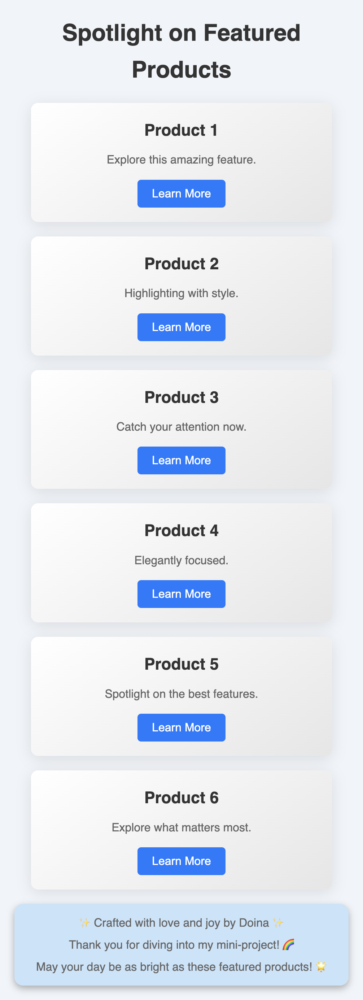
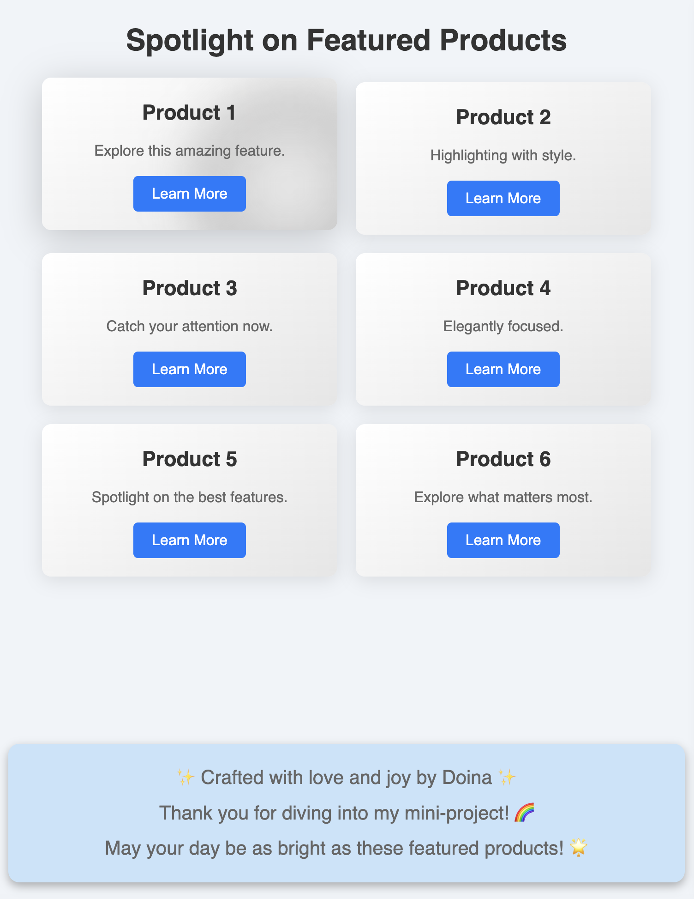
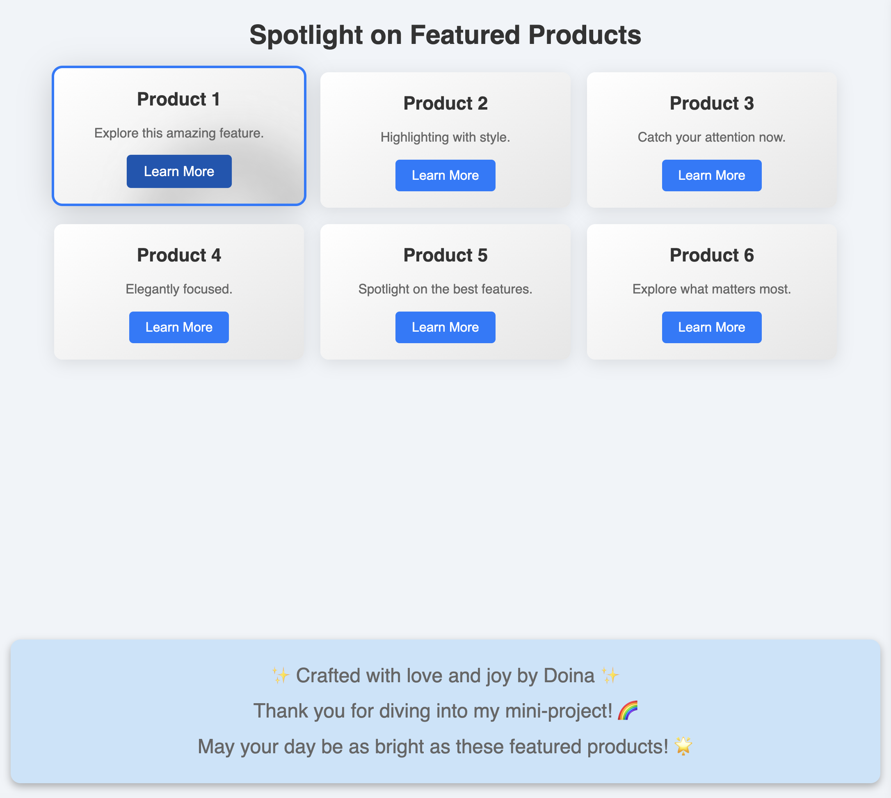

# Spotlight Effect Project

A personal project where I explored how to implement a spotlight effect on a grid layout using HTML, CSS, and JavaScript. The goal was to learn how to create dynamic, user-friendly interactions with this effect while ensuring full keyboard accessibility.

## Table of Contents

- [Spotlight Effect Project](#spotlight-effect-project)
  - [Table of Contents](#table-of-contents)
  - [Overview](#overview)
  - [Key Features](#key-features)
  - [Screenshots](#screenshots)
  - [Video Demonstration](#video-demonstration)
    - [Links](#links)
  - [My process](#my-process)
    - [Built with](#built-with)
    - [What I learned](#what-i-learned)
    - [Continued Development](#continued-development)
    - [Useful resources](#useful-resources)
  - [Installation Instructions](#installation-instructions)
  - [Dependencies](#dependencies)
  - [Usage Instructions](#usage-instructions)
  - [Project Structure](#project-structure)
    - [Key Files](#key-files)
  - [Author](#author)

## Overview

The **Spotlight Effect Project** demonstrates a visually engaging spotlight effect that highlights grid sections as the user interacts with them. The goal of this project was to learn how to create and implement this effect, which tracks the cursor on hover or keyboard focus, adding interactivity and accessibility to the design.

## Key Features

- **Dynamic Grid Layout**: The grid is built using CSS Grid, providing a structured and responsive layout.
- **Spotlight Effect**: A circular highlight dynamically follows the user's cursor or focused grid item, creating a smooth and interactive experience.
- **Accessibility**: Full keyboard navigation support, ensuring that users relying on assistive technology can also experience the spotlight effect.

## Screenshots

Here are some screenshots to illustrate the project:

| Device      | State   | Screenshot                                                                                     |
| ----------- | ------- | ---------------------------------------------------------------------------------------------- |
| **Mobile**  | Default |      |
| **Tablet**  | Hover   |  |
| **Desktop** | Select  |   |

## Video Demonstration

Here’s a short demonstration of the footer text effect in my project:

[Watch the video demonstration](images/video-demo.mp4)

### Links

- [Live Demo](https://doileo.github.io/spotlight-effect/)
- [GitHub Repository](https://github.com/Doileo/kids-schedule-organizer)

## My process

### Built with

- HTML5
- CSS3
- JavaScript
- Lighthouse

### What I learned

- **Spotlight Effect**: I created a spotlight effect on items in a grid layout using CSS. This effect dims the background while highlighting the item under the cursor.

- **JavaScript Functionality**: I utilized JavaScript to make the spotlight effect interactive. When the user hovers over an item, the spotlight adjusts in real-time to maintain focus on that item.

- **Accessibility Features**: I ensured the spotlight effect is accessible. Users can navigate using the keyboard, and the effect does not hinder screen reader functionality.

### Continued Development

Future improvements may include:

- Integrating additional animations to enhance the spotlight effect.
- Expanding the product grid with more items and varying content.
- Adding real product data and images from an API.

### Useful resources

**CSS Spotlight Effect**

- [Creating a Spotlight Effect with CSS](https://css-tricks.com/spotlight-effect/) - A comprehensive guide on how to implement a CSS spotlight effect.

**JavaScript for Interactive Effects**

- [JavaScript for Beginners](https://developer.mozilla.org/en-US/docs/Learn/JavaScript) - Mozilla's official guide to learning JavaScript, covering the basics you'll need for interactive effects.
- [Using Mouse Events in JavaScript](https://www.w3schools.com/js/js_htmldom_events.asp) - Learn how to handle mouse events for creating interactive elements.

**Accessibility**

- [Web Content Accessibility Guidelines (WCAG)](https://www.w3.org/WAI/WCAG21/quickref/) - Guidelines for making web content more accessible, including tips relevant to dynamic effects like this spotlight.
- [Accessible JavaScript](https://www.smashingmagazine.com/2020/06/accessible-javascript/) - Best practices for ensuring your JavaScript interactions are accessible.

**Additional Tools**

- [Lighthouse](https://developers.google.com/web/tools/lighthouse) - A tool to audit the web page for performance, accessibility, and SEO.

## Installation Instructions

1. Clone the repository:

   ```bash
   git clone https://github.com/yourusername/spotlight-effect.git

   ```

2. Navigate to the project directory:
   ```bash
   cd spotlight-effect
   ```
3. Open `index.html` in your preferred web browser to view the project.

## Dependencies

No external dependencies are required for this project. All styles and functionality are handled through native HTML, CSS, and JavaScript.

## Usage Instructions

- Move your mouse over the grid items to see the spotlight effect in action.
- Each product's details and button will be highlighted by the spotlight.
- The spotlight effect is designed to enhance user interaction without hindering accessibility.

## Project Structure

- `index.html`
- `style.css`
- `index.js`
- `images/`
- `README.md`

### Key Files

- `index.html`: The main HTML file containing the structure of the spotlight effect.
- `styles.css`: The stylesheet defining the styles for the spotlight effect and grid layout.
- `index.js`: The JavaScript file implementing the spotlight effect and handling user interactions.
- `images/`: Folder containing screenshots of the project in both mobile, tablet and desktop views (default ,hover and select states).
- `README.md`: Documentation file for the project.

## Author

- LinkedIn - [@Doina](https://www.linkedin.com/in/doinaleovchindeveloper/)
- GitHub - [@Doileo](https://github.com/Doileo)
